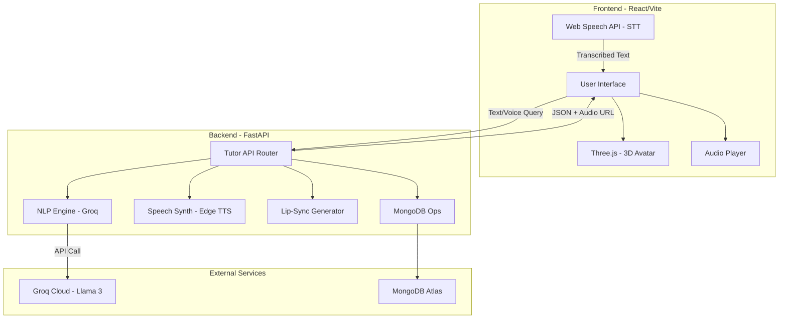

# System Architecture - AI Guru J

AI Guru J is an interactive AI-powered Python tutor featuring a 3D avatar, real-time voice interaction, and automated code explanation.

## 1. High-Level Overview

The system follows a modern client-server architecture with a React-based frontend and a Python-based FastAPI backend. It integrates multiple AI services for Natural Language Processing (NLP), Text-to-Speech (TTS), and real-time animation.

---

## 2. Frontend Architecture (React + Vite)

The frontend is responsible for the user interface, 3D rendering, and audio playback.

### Key Components:
- **`ThreeScene.jsx`**: Handles the 3D environment using `@react-three/fiber` and `@react-three/drei`. Manages the avatar models, animations, and lip-sync state.
- **`SearchBar.jsx`**: The primary interaction point. It includes:
    - Text input for manual queries.
    - **Web Speech API** integration for real-time speech-to-text (STT) activation via wake word "Guru Ji".
- **`CodePanel.jsx`**: Displays the Python code generated by the AI with syntax highlighting.
- **`ExplanationPanel.jsx`**: Shows the line-by-line explanation of the code.
- **`App.jsx`**: Orchestrates the state between the search bar, the 3D scene, and the display panels.

### Technologies:
- **React**: UI Framework.
- **Three.js / React Three Fiber**: 3D Rendering.
- **Web Speech API**: Browser-native STT.
- **Glassmorphism / Vanilla CSS**: Modern, premium UI styling.

---

## 3. Backend Architecture (FastAPI)

The backend acts as an orchestrator, connecting the frontend with various AI engines and persistent storage.

### Core Modules:
- **`api/tutor_router.py`**: The main API endpoint (`/query/`). It coordinates the flow:
    1. Receives the user query.
    2. Calls the NLP engine.
    3. Triggers TTS and Lip-Sync generation.
    4. Logs the interaction to the database.
- **`core/nlp_engine.py`**: Interacts with the **Groq Cloud API** (using `llama-3.1-8b-instant`). It uses a specialized prompt to ensure the output is suitable for children (Python Tutor persona).
- **`core/speech_synth.py`**: Uses **Edge TTS** to generate high-quality speech. It returns a streaming audio URL or a temporary file path.
- **`utils/rhubarb_generator.py`**: (Or internal mock) Generates mouth cues (lip-sync data) based on the generated text to drive the 3D avatar's mouth.
- **`database/mongodb_ops.py`**: Handles asynchronous logging of interactions to **MongoDB Atlas** for history and analytics.

---

## 4. Data Flow

1.  **Input**: User speaks "Guru Ji" or types a query in the `SearchBar`.
2.  **STT**: If voice, the browser's **Web Speech API** converts audio to text.
3.  **Request**: Frontend sends a POST request to `/api/tutor/query/`.
4.  **Processing**:
    - **NLP**: Backend sends the query to **Groq**. Groq returns Code + Explanation.
    - **TTS**: Backend (or via separate stream) generates an MP3 using **Edge TTS**.
    - **Lip-Sync**: Backend calculates mouth cues for the generated response.
5.  **Response**: Backend returns a JSON object containing:
    - Code segment.
    - Explanation text.
    - Audio URL.
    - Lip-sync mouth cues.
6.  **Rendering**:
    - `ThreeScene` starts the "speaking" animation and applies lip-sync cues.
    - `Audio` element plays the synthesized speech.
    - `CodePanel` and `ExplanationPanel` update with the new content.

---

## 5. Technology Stack Summary

| Layer | Technologies |
| :--- | :--- |
| **Frontend** | React, Vite, Three.js, R3F, Web Speech API |
| **Backend** | Python, FastAPI, Uvicorn |
| **AI / NLP** | Groq Cloud (Llama 3.1) |
| **TTS** | Edge TTS |
| **Database** | MongoDB Atlas |
| **Deployment** | Render (Web Service + Static Site) |

---

## 6. Infrastructure & Deployment

- **Backend**: Deployed as a Python Web Service on **Render**. Uses `Gunicorn`/`Uvicorn` for serving.
- **Frontend**: Deployed as a Static Site on **Render**.
- **Environment Variables**: Managed via Render Dashboard (API Keys, DB URIs, URLs).
